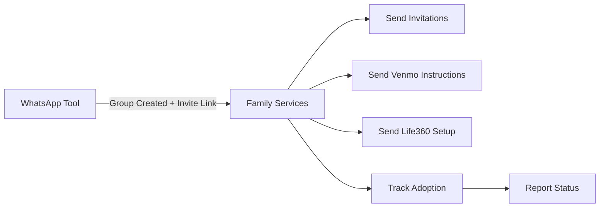

# Family Services Requirements Document
## Email-Based Family Bridge Services for iOS to Android Migration

### Executive Summary
This document specifies requirements for the family services component that handles all email-based family communications including WhatsApp invitations, Venmo Teen setup instructions, Life360 assistance, and adoption tracking. This component works in conjunction with the WhatsApp automation tool to complete the family bridge ecosystem.

**Core Capability**: Send personalized family service emails, track adoption, and report family connectivity status across all bridge services.

---

## 1. Project Context & Architecture

### 1.1 Problem Statement
After creating a WhatsApp group (via whatsapp automation tool), family members need:
- Invitation emails with group links (especially those not found in contacts)
- Venmo Teen setup instructions for eligible children
- Life360 location sharing setup guidance
- Consolidated adoption tracking across all services

### 1.2 Component Position
```
family-bridge/
└── src/family_bridge/
    ├── whatsapp/                    # Separate component (creates groups)
    ├── services/                    # THIS COMPONENT
    │   ├── gmail_client.py          # Gmail API integration
    │   ├── email_templates.py       # All family email templates
    │   ├── venmo_teen.py           # Venmo Teen instructions
    │   ├── life360.py              # Life360 setup assistance
    │   └── whatsapp_invites.py     # WhatsApp invitation emails
    ├── tracking/
    │   ├── adoption_monitor.py      # Check service adoption
    │   └── status_reporter.py       # Generate family status
    ├── shared/
    │   ├── database.py              # DuckDB for state
    │   └── family_data.py           # Family member management
    └── server.py                    # MCP server exposing tools
```

### 1.3 Data Flow


### 1.4 Scope
**IN SCOPE**:
- Gmail API integration for sending emails
- WhatsApp invitation emails (with links from automation tool)
- Venmo Teen setup instructions (manual process guidance)
- Life360 setup assistance (with invite codes)
- Family adoption tracking via email responses
- Consolidated status reporting

**OUT OF SCOPE**:
- WhatsApp group creation (handled by whatsapp automation)
- Actual Venmo account creation (manual process)
- Life360 API integration (manual setup)
- Photo migration emails (separate module)

---

## 2. Gmail Integration

### 2.1 Gmail Client Implementation

```python
from google.oauth2.credentials import Credentials
from googleapiclient.discovery import build
from email.mime.text import MIMEText
from email.mime.multipart import MIMEMultipart
import base64

class FamilyGmailClient:
    """
    Gmail client for family service communications
    Separate from photo-migration's Gmail integration
    """
    
    def __init__(self, credentials_path: str = None):
        """
        Initialize Gmail client
        
        Args:
            credentials_path: Path to Gmail OAuth credentials
                             Defaults to GMAIL_CREDENTIALS_PATH env var
        """
        if not credentials_path:
            credentials_path = os.getenv('GMAIL_CREDENTIALS_PATH')
        
        if not credentials_path:
            raise ValueError("Gmail credentials path required")
        
        self.credentials_path = credentials_path
        self.service = None
        self.sender_email = None
    
    async def authenticate(self):
        """Authenticate with Gmail API"""
        creds = Credentials.from_authorized_user_file(
            self.credentials_path,
            ['https://www.googleapis.com/auth/gmail.send',
             'https://www.googleapis.com/auth/gmail.readonly']
        )
        
        if creds and creds.expired and creds.refresh_token:
            creds.refresh(Request())
        
        self.service = build('gmail', 'v1', credentials=creds)
        
        # Get sender email
        profile = self.service.users().getProfile(userId='me').execute()
        self.sender_email = profile['emailAddress']
        
        logger.info(f"Gmail authenticated as {self.sender_email}")
    
    async def send_family_email(
        self,
        to_email: str,
        subject: str,
        body_html: str,
        body_text: str = None,
        cc_emails: List[str] = None
    ) -> Dict[str, Any]:
        """
        Send email to family member
        
        Args:
            to_email: Recipient email
            subject: Email subject
            body_html: HTML email body
            body_text: Plain text fallback
            cc_emails: Optional CC recipients (e.g., parent)
        
        Returns:
            {"status": "sent", "message_id": "..."}
        """
        try:
            message = MIMEMultipart('alternative')
            message['From'] = self.sender_email
            message['To'] = to_email
            message['Subject'] = subject
            
            if cc_emails:
                message['Cc'] = ', '.join(cc_emails)
            
            # Add plain text part
            if body_text:
                text_part = MIMEText(body_text, 'plain')
                message.attach(text_part)
            
            # Add HTML part
            html_part = MIMEText(body_html, 'html')
            message.attach(html_part)
            
            # Send message
            raw_message = base64.urlsafe_b64encode(
                message.as_bytes()
            ).decode('utf-8')
            
            result = self.service.users().messages().send(
                userId='me',
                body={'raw': raw_message}
            ).execute()
            
            return {
                "status": "sent",
                "message_id": result['id'],
                "to": to_email,
                "subject": subject
            }
            
        except Exception as e:
            logger.error(f"Failed to send email to {to_email}: {e}")
            return {
                "status": "failed",
                "error": str(e),
                "to": to_email
            }
    
    async def check_for_responses(
        self,
        from_email: str,
        subject_keywords: List[str],
        days_back: int = 7
    ) -> List[Dict]:
        """
        Check for email responses from family members
        Used for adoption tracking
        """
        try:
            query = f"from:{from_email}"
            for keyword in subject_keywords:
                query += f" OR subject:{keyword}"
            
            results = self.service.users().messages().list(
                userId='me',
                q=query,
                maxResults=10
            ).execute()
            
            messages = results.get('messages', [])
            responses = []
            
            for msg in messages:
                full_msg = self.service.users().messages().get(
                    userId='me',
                    id=msg['id']
                ).execute()
                
                responses.append({
                    "id": msg['id'],
                    "from": from_email,
                    "snippet": full_msg.get('snippet', ''),
                    "date": full_msg.get('internalDate', '')
                })
            
            return responses
            
        except Exception as e:
            logger.error(f"Failed to check responses: {e}")
            return []
```

---

## 3. Email Templates

### 3.1 Template System

```python
class FamilyEmailTemplates:
    """
    Centralized email templates for all family services
    """
    
    @staticmethod
    def whatsapp_invitation(
        recipient_name: str,
        group_name: str,
        invite_link: str,
        sender_name: str = "Dad",
        is_direct_member: bool = False
    ) -> Dict[str, str]:
        """
        WhatsApp group invitation email
        
        Args:
            recipient_name: Family member name
            group_name: WhatsApp group name
            invite_link: Group invite link from WhatsApp automation
            sender_name: Who's sending (Dad/Mom/etc)
            is_direct_member: True if already added, False if needs link
        """
        
        if is_direct_member:
            # Already added to group
            subject = f"You've been added to {group_name} on WhatsApp!"
            
            body_html = f"""
            <html>
            <body style="font-family: -apple-system, BlinkMacSystemFont, 'Segoe UI', Roboto, sans-serif; max-width: 600px; margin: 0 auto; padding: 20px;">
                <h2 style="color: #25D366;">Hi {recipient_name}! 👋</h2>
                
                <p style="font-size: 16px; line-height: 1.5;">
                    Great news! You've already been added to our family WhatsApp group 
                    <strong>"{group_name}"</strong>!
                </p>
                
                <div style="background: #f0f9ff; border-left: 4px solid #25D366; padding: 15px; margin: 20px 0;">
                    <p style="margin: 0; font-size: 16px;">
                        <strong>✅ You're all set!</strong><br>
                        Just open WhatsApp and you'll see the group in your chats.
                    </p>
                </div>
                
                <p style="font-size: 16px; line-height: 1.5;">
                    This group replaces our iMessage group chat now that {sender_name} has 
                    switched to Android. WhatsApp works perfectly across iPhone and Android!
                </p>
                
                <p style="font-size: 16px; line-height: 1.5;">
                    <strong>Why WhatsApp is better:</strong>
                </p>
                <ul style="font-size: 16px; line-height: 1.5;">
                    <li>📸 Full quality photo and video sharing</li>
                    <li>🎥 Group video calls up to 8 people</li>
                    <li>🔒 End-to-end encryption</li>
                    <li>📱 Works on any phone, tablet, or computer</li>
                </ul>
                
                <p style="font-size: 16px; color: #666; margin-top: 30px;">
                    See you in the group chat!<br>
                    {sender_name}'s Migration Assistant 🤖
                </p>
            </body>
            </html>
            """
        else:
            # Needs to join via link
            subject = f"Join our family WhatsApp group: {group_name}"
            
            body_html = f"""
            <html>
            <body style="font-family: -apple-system, BlinkMacSystemFont, 'Segoe UI', Roboto, sans-serif; max-width: 600px; margin: 0 auto; padding: 20px;">
                <h2 style="color: #25D366;">Hi {recipient_name}! 👋</h2>
                
                <p style="font-size: 16px; line-height: 1.5;">
                    {sender_name} has created a family WhatsApp group called 
                    <strong>"{group_name}"</strong> to keep everyone connected 
                    now that they've switched to Android.
                </p>
                
                <div style="background: #f0f9ff; border-left: 4px solid #25D366; padding: 15px; margin: 20px 0;">
                    <p style="margin: 0 0 15px 0; font-size: 16px;">
                        <strong>Join in 2 easy steps:</strong>
                    </p>
                    <ol style="margin: 0; padding-left: 20px;">
                        <li>Make sure WhatsApp is installed on your iPhone</li>
                        <li>Click the button below to join the group</li>
                    </ol>
                </div>
                
                <div style="text-align: center; margin: 30px 0;">
                    <a href="{invite_link}" 
                       style="display: inline-block; background: #25D366; color: white; 
                              padding: 12px 30px; border-radius: 25px; text-decoration: none; 
                              font-size: 18px; font-weight: bold;">
                        Join Family Group 
                    </a>
                </div>
                
                <p style="font-size: 14px; color: #666; text-align: center;">
                    Or copy this link: <code>{invite_link}</code>
                </p>
                
                <p style="font-size: 16px; line-height: 1.5;">
                    <strong>Why we're using WhatsApp:</strong>
                </p>
                <ul style="font-size: 16px; line-height: 1.5;">
                    <li>Works perfectly between iPhone and Android</li>
                    <li>Better photo/video quality than SMS</li>
                    <li>Free messaging, calls, and video chat</li>
                    <li>You keep your iPhone - nothing changes!</li>
                </ul>
                
                <p style="font-size: 14px; color: #999; margin-top: 30px; padding-top: 20px; border-top: 1px solid #eee;">
                    Need help? Just reply to this email or text {sender_name}.<br>
                    - {sender_name}'s Migration Assistant 🤖
                </p>
            </body>
            </html>
            """
        
        body_text = f"""
        Hi {recipient_name}!
        
        {"You've been added to" if is_direct_member else "Please join"} our family WhatsApp group: {group_name}
        
        {"Just open WhatsApp to see the group." if is_direct_member else f"Join here: {invite_link}"}
        
        This replaces our iMessage group now that {sender_name} has Android.
        
        - {sender_name}'s Migration Assistant
        """
        
        return {
            "subject": subject,
            "body_html": body_html,
            "body_text": body_text
        }
    
    @staticmethod
    def venmo_teen_instructions(
        teen_name: str,
        teen_age: int,
        parent_email: str,
        signup_link: str,
        monthly_allowance: str = None,
        allowance_reason: str = None
    ) -> Dict[str, str]:
        """
        Venmo Teen setup instructions email
        """
        
        # Age-appropriate greeting
        if teen_age >= 16:
            greeting = f"Hey {teen_name}! 🎉"
            tone = "Your dad switched phones, so we're upgrading how you get paid."
        else:
            greeting = f"Hi {teen_name}! 👋"
            tone = "Dad got a new phone, so we have a new way to send your allowance."
        
        # Allowance context
        allowance_text = ""
        if monthly_allowance:
            if allowance_reason:
                allowance_text = f"Your ${monthly_allowance}/month for {allowance_reason} is ready to go!"
            else:
                allowance_text = f"Your ${monthly_allowance} monthly allowance is ready!"
        
        subject = f"Your Venmo Teen Account is Ready, {teen_name}!"
        
        body_html = f"""
        <html>
        <body style="font-family: -apple-system, BlinkMacSystemFont, 'Segoe UI', Roboto, sans-serif; max-width: 600px; margin: 0 auto; padding: 20px;">
            <h2 style="color: #3D95CE;">{greeting}</h2>
            
            <p style="font-size: 16px; line-height: 1.5;">
                {tone} Since Apple Cash doesn't work with Android, 
                you're getting something better - <strong>Venmo Teen</strong>!
            </p>
            
            {f'<p style="font-size: 18px; color: #3D95CE; font-weight: bold;">{allowance_text}</p>' if allowance_text else ''}
            
            <div style="background: #f8f9fa; border-left: 4px solid #3D95CE; padding: 15px; margin: 20px 0;">
                <p style="margin: 0 0 10px 0; font-size: 16px;">
                    <strong>Your setup link (save this!):</strong>
                </p>
                <p style="margin: 0; word-break: break-all;">
                    <a href="{signup_link}" style="color: #3D95CE; font-size: 14px;">
                        {signup_link}
                    </a>
                </p>
            </div>
            
            <p style="font-size: 16px; line-height: 1.5;">
                <strong>Quick Setup (5 minutes):</strong>
            </p>
            <ol style="font-size: 16px; line-height: 1.8;">
                <li>Download Venmo from the App Store</li>
                <li>Tap your special signup link above</li>
                <li>Follow the setup steps</li>
                <li>Dad will approve automatically</li>
                <li>Get your first payment! 💰</li>
            </ol>
            
            <p style="font-size: 16px; line-height: 1.5;">
                <strong>Why Venmo Teen is awesome:</strong>
            </p>
            <ul style="font-size: 16px; line-height: 1.5;">
                <li>🏦 Your own debit card (if you want one)</li>
                <li>👥 Split costs with friends</li>
                <li>📱 Works with any phone</li>
                <li>🎯 Way more popular than Apple Cash</li>
            </ul>
            
            <div style="background: #fff3cd; border: 1px solid #ffc107; border-radius: 5px; padding: 10px; margin: 20px 0;">
                <p style="margin: 0; font-size: 14px;">
                    <strong>⚠️ Important:</strong> You must use the link above - it's unique to you. 
                    Save this email!
                </p>
            </div>
            
            <p style="font-size: 14px; color: #666; margin-top: 30px;">
                Questions? Text Dad or ask in the family WhatsApp!<br>
                - Dad's Migration Assistant 🤖
            </p>
            
            <p style="font-size: 12px; color: #999; margin-top: 20px; padding-top: 20px; border-top: 1px solid #eee;">
                This email was also sent to your parent at {parent_email} for transparency.
            </p>
        </body>
        </html>
        """
        
        body_text = f"""
        {greeting}
        
        {tone}
        
        Your Venmo Teen account is ready! {allowance_text}
        
        Your unique signup link:
        {signup_link}
        
        Setup steps:
        1. Download Venmo from App Store
        2. Use your link above
        3. Complete setup
        4. Get paid!
        
        - Dad's Migration Assistant
        """
        
        return {
            "subject": subject,
            "body_html": body_html,
            "body_text": body_text
        }
    
    @staticmethod
    def life360_setup(
        recipient_name: str,
        relationship: str,  # "spouse", "child"
        circle_name: str,
        invite_code: str,
        sender_name: str = "Dad"
    ) -> Dict[str, str]:
        """
        Life360 location sharing setup email
        """
        
        if relationship == "spouse":
            greeting = f"Hi {recipient_name}!"
            context = f"Since {sender_name} switched to Android, Find My doesn't work between us anymore."
        else:
            greeting = f"Hey {recipient_name}!"
            context = f"Dad switched to Android, so we need a new way to share locations."
        
        subject = f"Join our {circle_name} on Life360"
        
        body_html = f"""
        <html>
        <body style="font-family: -apple-system, BlinkMacSystemFont, 'Segoe UI', Roboto, sans-serif; max-width: 600px; margin: 0 auto; padding: 20px;">
            <h2 style="color: #7F3F98;">{greeting} 📍</h2>
            
            <p style="font-size: 16px; line-height: 1.5;">
                {context} <strong>Life360</strong> is even better - 
                it works across all phones and has more features!
            </p>
            
            <div style="background: #f8f9fa; border-left: 4px solid #7F3F98; padding: 15px; margin: 20px 0;">
                <p style="margin: 0 0 10px 0; font-size: 16px;">
                    <strong>Your family circle invite code:</strong>
                </p>
                <p style="margin: 0; font-size: 24px; font-weight: bold; color: #7F3F98; letter-spacing: 2px;">
                    {invite_code}
                </p>
                <p style="margin: 10px 0 0 0; font-size: 14px; color: #666;">
                    This code expires in 48 hours
                </p>
            </div>
            
            <p style="font-size: 16px; line-height: 1.5;">
                <strong>Quick Setup:</strong>
            </p>
            <ol style="font-size: 16px; line-height: 1.8;">
                <li>Download Life360 from the App Store (free)</li>
                <li>Create your account</li>
                <li>Tap "Join a Circle"</li>
                <li>Enter code: <strong>{invite_code}</strong></li>
                <li>You're connected! 🎉</li>
            </ol>
            
            <p style="font-size: 16px; line-height: 1.5;">
                <strong>Why Life360 is better than Find My:</strong>
            </p>
            <ul style="font-size: 16px; line-height: 1.5;">
                <li>🚗 Driving reports and speed alerts</li>
                <li>📱 Works with any phone (iPhone or Android)</li>
                <li>🔔 Arrival/departure notifications</li>
                <li>🆘 Emergency SOS features</li>
                <li>📊 Location history</li>
            </ul>
            
            <p style="font-size: 14px; color: #666; margin-top: 30px;">
                The whole family is switching - see you there!<br>
                - {sender_name}'s Migration Assistant 🤖
            </p>
        </body>
        </html>
        """
        
        body_text = f"""
        {greeting}
        
        {context}
        
        Join our Life360 family circle!
        
        Invite Code: {invite_code}
        (Expires in 48 hours)
        
        Setup:
        1. Download Life360
        2. Create account
        3. Join circle with code
        
        - {sender_name}'s Migration Assistant
        """
        
        return {
            "subject": subject,
            "body_html": body_html,
            "body_text": body_text
        }
```

---

## 4. Service Implementations

### 4.1 WhatsApp Invitation Service

```python
class WhatsAppInvitationService:
    """
    Handles WhatsApp group invitations
    Works with output from WhatsApp automation tool
    """
    
    def __init__(self, gmail_client: FamilyGmailClient, database: FamilyDatabase):
        self.gmail = gmail_client
        self.db = database
    
    async def send_invitations(
        self,
        group_name: str,
        invite_link: str,
        family_members: List[Dict],
        members_added_directly: List[str] = None,
        sender_name: str = "Dad"
    ) -> Dict[str, Any]:
        """
        Send WhatsApp invitations based on automation results
        
        Args:
            group_name: Name of WhatsApp group
            invite_link: Invite link from WhatsApp automation
            family_members: All family members
            members_added_directly: Members already added (found in contacts)
            sender_name: Who's sending
        
        Returns:
            Summary of sent invitations
        """
        
        members_added_directly = members_added_directly or []
        results = []
        
        for member in family_members:
            # Determine if they need invite link or just notification
            is_direct_member = member["name"] in members_added_directly
            
            # Generate appropriate email
            email_content = FamilyEmailTemplates.whatsapp_invitation(
                recipient_name=member["name"],
                group_name=group_name,
                invite_link=invite_link if not is_direct_member else None,
                sender_name=sender_name,
                is_direct_member=is_direct_member
            )
            
            # Send email
            result = await self.gmail.send_family_email(
                to_email=member["email"],
                subject=email_content["subject"],
                body_html=email_content["body_html"],
                body_text=email_content["body_text"]
            )
            
            # Store in database
            await self.db.record_invitation(
                service="whatsapp",
                recipient_name=member["name"],
                recipient_email=member["email"],
                status="direct_add" if is_direct_member else "invite_sent",
                metadata={
                    "group_name": group_name,
                    "invite_link": invite_link if not is_direct_member else None,
                    "email_sent": result["status"] == "sent"
                }
            )
            
            results.append({
                "name": member["name"],
                "email": member["email"],
                "type": "notification" if is_direct_member else "invitation",
                "status": result["status"]
            })
        
        return {
            "total_sent": len(results),
            "notifications_sent": len([r for r in results if r["type"] == "notification"]),
            "invitations_sent": len([r for r in results if r["type"] == "invitation"]),
            "details": results
        }
```

### 4.2 Venmo Teen Service

```python
class VenmoTeenService:
    """
    Handles Venmo Teen setup instructions
    Note: Actual account creation is manual
    """
    
    def __init__(self, gmail_client: FamilyGmailClient, database: FamilyDatabase):
        self.gmail = gmail_client
        self.db = database
        self.MIN_AGE = 13  # Venmo Teen requirement
    
    async def send_setup_instructions(
        self,
        teen_name: str,
        teen_email: str,
        teen_age: int,
        parent_email: str,
        signup_link: str,
        monthly_allowance: str = None,
        allowance_reason: str = None
    ) -> Dict[str, Any]:
        """
        Send Venmo Teen setup instructions
        
        Args:
            teen_name: Teen's name
            teen_email: Teen's email
            teen_age: Teen's age (must be 13+)
            parent_email: Parent email for CC
            signup_link: Unique Venmo Teen signup link (manually generated)
            monthly_allowance: Optional allowance amount
            allowance_reason: Optional reason (e.g., "mowing the lawn")
        """
        
        # Validate age
        if teen_age < self.MIN_AGE:
            return {
                "status": "ineligible",
                "reason": f"{teen_name} is {teen_age}, must be {self.MIN_AGE}+ for Venmo Teen",
                "message": f"Will continue using Apple Cash until age {self.MIN_AGE}"
            }
        
        # Generate email
        email_content = FamilyEmailTemplates.venmo_teen_instructions(
            teen_name=teen_name,
            teen_age=teen_age,
            parent_email=parent_email,
            signup_link=signup_link,
            monthly_allowance=monthly_allowance,
            allowance_reason=allowance_reason
        )
        
        # Send to teen with parent CC
        result = await self.gmail.send_family_email(
            to_email=teen_email,
            subject=email_content["subject"],
            body_html=email_content["body_html"],
            body_text=email_content["body_text"],
            cc_emails=[parent_email]
        )
        
        # Record in database
        await self.db.record_service_setup(
            service="venmo_teen",
            recipient_name=teen_name,
            recipient_email=teen_email,
            metadata={
                "age": teen_age,
                "signup_link": signup_link,
                "allowance": monthly_allowance,
                "parent_cc": parent_email,
                "email_sent": result["status"] == "sent"
            }
        )
        
        return {
            "status": "instructions_sent",
            "teen_name": teen_name,
            "message": f"Setup instructions sent to {teen_name} (CC: parent)"
        }
```

### 4.3 Life360 Service

```python
class Life360Service:
    """
    Handles Life360 family circle setup
    Note: Circle creation and invite codes are manual
    """
    
    def __init__(self, gmail_client: FamilyGmailClient, database: FamilyDatabase):
        self.gmail = gmail_client
        self.db = database
    
    async def send_circle_invitations(
        self,
        circle_name: str,
        invite_code: str,
        family_members: List[Dict],
        sender_name: str = "Dad"
    ) -> Dict[str, Any]:
        """
        Send Life360 circle invitations
        
        Args:
            circle_name: Name of Life360 circle
            invite_code: Manual invite code from Life360 app
            family_members: Family members to invite
            sender_name: Who's sending
        """
        
        results = []
        
        for member in family_members:
            # Generate email
            email_content = FamilyEmailTemplates.life360_setup(
                recipient_name=member["name"],
                relationship=member.get("relationship", "family"),
                circle_name=circle_name,
                invite_code=invite_code,
                sender_name=sender_name
            )
            
            # Send email
            result = await self.gmail.send_family_email(
                to_email=member["email"],
                subject=email_content["subject"],
                body_html=email_content["body_html"],
                body_text=email_content["body_text"]
            )
            
            # Record in database
            await self.db.record_service_setup(
                service="life360",
                recipient_name=member["name"],
                recipient_email=member["email"],
                metadata={
                    "circle_name": circle_name,
                    "invite_code": invite_code,
                    "relationship": member.get("relationship"),
                    "email_sent": result["status"] == "sent"
                }
            )
            
            results.append({
                "name": member["name"],
                "email": member["email"],
                "status": result["status"]
            })
        
        return {
            "circle_name": circle_name,
            "invite_code": invite_code,
            "invitations_sent": len(results),
            "expires_in": "48 hours",
            "details": results
        }
```

---

## 5. Adoption Tracking

### 5.1 Adoption Monitor

```python
class FamilyAdoptionMonitor:
    """
    Tracks family adoption across all services
    """
    
    def __init__(
        self,
        gmail_client: FamilyGmailClient,
        database: FamilyDatabase
    ):
        self.gmail = gmail_client
        self.db = database
    
    async def check_family_adoption(
        self,
        services: List[str] = None
    ) -> Dict[str, Any]:
        """
        Check adoption status across services
        
        Args:
            services: Services to check (default: all)
        
        Returns:
            Comprehensive adoption status
        """
        
        if not services:
            services = ["whatsapp", "venmo", "life360"]
        
        adoption_status = {}
        
        for service in services:
            if service == "whatsapp":
                adoption_status["whatsapp"] = await self._check_whatsapp_adoption()
            elif service == "venmo":
                adoption_status["venmo"] = await self._check_venmo_adoption()
            elif service == "life360":
                adoption_status["life360"] = await self._check_life360_adoption()
        
        # Calculate overall adoption
        total_members = await self.db.get_family_member_count()
        adopted_counts = {
            service: len([m for m in status.get("members", []) 
                         if m.get("status") == "active"])
            for service, status in adoption_status.items()
        }
        
        return {
            "timestamp": datetime.now().isoformat(),
            "total_family_members": total_members,
            "services": adoption_status,
            "summary": {
                "whatsapp_adoption": f"{adopted_counts.get('whatsapp', 0)}/{total_members}",
                "venmo_adoption": f"{adopted_counts.get('venmo', 0)}/{total_members}",
                "life360_adoption": f"{adopted_counts.get('life360', 0)}/{total_members}",
                "overall_success_rate": self._calculate_success_rate(adopted_counts, total_members)
            }
        }
    
    async def _check_whatsapp_adoption(self) -> Dict:
        """Check WhatsApp group adoption"""
        
        # Get invitation records
        invitations = await self.db.get_service_records("whatsapp")
        
        members = []
        for invite in invitations:
            # Check for email responses
            responses = await self.gmail.check_for_responses(
                from_email=invite["recipient_email"],
                subject_keywords=["whatsapp", "joined", "group"],
                days_back=7
            )
            
            status = "active" if responses else "pending"
            
            # Override if directly added
            if invite.get("status") == "direct_add":
                status = "active"
            
            members.append({
                "name": invite["recipient_name"],
                "status": status,
                "method": "direct_add" if invite.get("status") == "direct_add" else "invite_link",
                "last_activity": responses[0]["date"] if responses else None
            })
        
        return {
            "group_active": True,
            "members": members,
            "adoption_rate": len([m for m in members if m["status"] == "active"]) / len(members) * 100 if members else 0
        }
    
    async def _check_venmo_adoption(self) -> Dict:
        """Check Venmo Teen adoption"""
        
        setups = await self.db.get_service_records("venmo_teen")
        
        members = []
        for setup in setups:
            # For demo purposes, check email responses
            responses = await self.gmail.check_for_responses(
                from_email=setup["recipient_email"],
                subject_keywords=["venmo", "account", "setup"],
                days_back=7
            )
            
            status = "active" if responses else "pending"
            
            members.append({
                "name": setup["recipient_name"],
                "age": setup.get("metadata", {}).get("age"),
                "status": status,
                "allowance": setup.get("metadata", {}).get("allowance")
            })
        
        return {
            "eligible_teens": len(members),
            "members": members,
            "adoption_rate": len([m for m in members if m["status"] == "active"]) / len(members) * 100 if members else 0
        }
    
    async def _check_life360_adoption(self) -> Dict:
        """Check Life360 circle adoption"""
        
        invitations = await self.db.get_service_records("life360")
        
        members = []
        for invite in invitations:
            # Check for responses
            responses = await self.gmail.check_for_responses(
                from_email=invite["recipient_email"],
                subject_keywords=["life360", "joined", "circle"],
                days_back=7
            )
            
            status = "active" if responses else "pending"
            
            members.append({
                "name": invite["recipient_name"],
                "status": status,
                "relationship": invite.get("metadata", {}).get("relationship")
            })
        
        circle_name = invitations[0].get("metadata", {}).get("circle_name") if invitations else "Family"
        
        return {
            "circle_name": circle_name,
            "members": members,
            "adoption_rate": len([m for m in members if m["status"] == "active"]) / len(members) * 100 if members else 0
        }
    
    def _calculate_success_rate(self, adopted_counts: Dict, total_members: int) -> float:
        """Calculate overall success rate"""
        if not total_members:
            return 0
        
        total_adoptions = sum(adopted_counts.values())
        total_possible = total_members * len(adopted_counts)
        
        return (total_adoptions / total_possible * 100) if total_possible else 0
```

---

## 6. Database Schema

### 6.1 DuckDB Tables

```sql
-- Family members table
CREATE TABLE family_members (
    id INTEGER PRIMARY KEY,
    name VARCHAR NOT NULL,
    email VARCHAR NOT NULL,
    relationship VARCHAR,  -- spouse, child, parent
    age INTEGER,
    created_at TIMESTAMP DEFAULT CURRENT_TIMESTAMP
);

-- Service invitations/setups
CREATE TABLE service_records (
    id INTEGER PRIMARY KEY,
    service VARCHAR NOT NULL,  -- whatsapp, venmo_teen, life360
    recipient_name VARCHAR NOT NULL,
    recipient_email VARCHAR NOT NULL,
    status VARCHAR,  -- sent, active, pending, failed
    metadata JSON,  -- Service-specific data
    created_at TIMESTAMP DEFAULT CURRENT_TIMESTAMP,
    updated_at TIMESTAMP DEFAULT CURRENT_TIMESTAMP
);

-- Email tracking
CREATE TABLE email_tracking (
    id INTEGER PRIMARY KEY,
    message_id VARCHAR,
    to_email VARCHAR,
    subject VARCHAR,
    service VARCHAR,
    status VARCHAR,  -- sent, bounced, responded
    sent_at TIMESTAMP DEFAULT CURRENT_TIMESTAMP
);

-- Adoption metrics
CREATE TABLE adoption_metrics (
    id INTEGER PRIMARY KEY,
    timestamp TIMESTAMP DEFAULT CURRENT_TIMESTAMP,
    service VARCHAR,
    total_members INTEGER,
    active_members INTEGER,
    adoption_rate FLOAT,
    metadata JSON
);
```

---

## 7. MCP Tool Interface

### 7.1 Tool Definitions

```python
@server.list_tools()
async def handle_list_tools() -> list[types.Tool]:
    return [
        types.Tool(
            name="send_family_invitations",
            description="Send WhatsApp group invitations to family members",
            inputSchema={
                "type": "object",
                "properties": {
                    "service": {
                        "type": "string",
                        "enum": ["whatsapp"],
                        "description": "Service type"
                    },
                    "group_name": {
                        "type": "string",
                        "description": "WhatsApp group name"
                    },
                    "invite_link": {
                        "type": "string",
                        "description": "Group invite link from WhatsApp automation"
                    },
                    "family_members": {
                        "type": "array",
                        "items": {
                            "type": "object",
                            "properties": {
                                "name": {"type": "string"},
                                "email": {"type": "string"}
                            }
                        }
                    },
                    "members_added_directly": {
                        "type": "array",
                        "items": {"type": "string"},
                        "description": "Names of members already added to group"
                    }
                },
                "required": ["service", "group_name", "invite_link", "family_members"]
            }
        ),
        types.Tool(
            name="send_venmo_teen_instructions",
            description="Send Venmo Teen setup instructions to eligible teen",
            inputSchema={
                "type": "object",
                "properties": {
                    "teen_name": {"type": "string"},
                    "teen_email": {"type": "string"},
                    "teen_age": {"type": "integer"},
                    "signup_link": {
                        "type": "string",
                        "description": "Unique Venmo Teen signup link"
                    },
                    "allowance_amount": {"type": "string"},
                    "allowance_reason": {"type": "string"}
                },
                "required": ["teen_name", "teen_email", "teen_age", "signup_link"]
            }
        ),
        types.Tool(
            name="send_life360_instructions",
            description="Send Life360 circle invitations to family",
            inputSchema={
                "type": "object",
                "properties": {
                    "circle_name": {"type": "string"},
                    "invite_code": {
                        "type": "string",
                        "description": "Life360 invite code (e.g., INJ-JOQ)"
                    },
                    "family_members": {
                        "type": "array",
                        "items": {
                            "type": "object",
                            "properties": {
                                "name": {"type": "string"},
                                "email": {"type": "string"},
                                "relationship": {"type": "string"}
                            }
                        }
                    }
                },
                "required": ["circle_name", "invite_code", "family_members"]
            }
        ),
        types.Tool(
            name="check_family_adoption",
            description="Check adoption status across all family services",
            inputSchema={
                "type": "object",
                "properties": {
                    "services": {
                        "type": "array",
                        "items": {
                            "type": "string",
                            "enum": ["whatsapp", "venmo", "life360"]
                        },
                        "description": "Services to check (default: all)"
                    }
                }
            }
        )
    ]
```

---

## 8. Testing Requirements

### 8.1 Unit Tests

```python
async def test_gmail_authentication():
    """Test Gmail API authentication"""
    gmail = FamilyGmailClient()
    await gmail.authenticate()
    assert gmail.sender_email is not None

async def test_email_template_generation():
    """Test all email templates"""
    # WhatsApp invitation
    template = FamilyEmailTemplates.whatsapp_invitation(
        recipient_name="Test User",
        group_name="Test Group",
        invite_link="https://chat.whatsapp.com/test"
    )
    assert "Test User" in template["body_html"]
    assert "Test Group" in template["subject"]

async def test_adoption_tracking():
    """Test adoption monitoring"""
    monitor = FamilyAdoptionMonitor(gmail, db)
    status = await monitor.check_family_adoption()
    assert "whatsapp" in status["services"]
```

---

## 9. Environment Configuration

```bash
# Gmail API (REQUIRED)
GMAIL_CREDENTIALS_PATH=./credentials/gmail_creds.json

# Database
DUCKDB_PATH=./data/family_bridge.db

# Settings
ADOPTION_CHECK_DAYS=7
EMAIL_BATCH_SIZE=10
```

---

## 10. Success Metrics

### 10.1 Technical Success
- ✅ All family members receive appropriate emails
- ✅ Templates are age and relationship appropriate  
- ✅ Adoption tracking provides accurate status
- ✅ Integration with WhatsApp automation output

### 10.2 Family Success
- ✅ Clear, non-technical instructions
- ✅ Appropriate tone for each family member
- ✅ Parents CC'd on teen communications
- ✅ Easy-to-follow setup steps

---

## Document Control

**Version**: 1.0.0
**Component**: Family Services (Email & Adoption Tracking)
**Dependencies**: WhatsApp Automation Tool, Gmail API
**Last Updated**: August 2025

This document provides complete requirements for implementing the family services component that handles all email-based family bridge communications and adoption tracking.