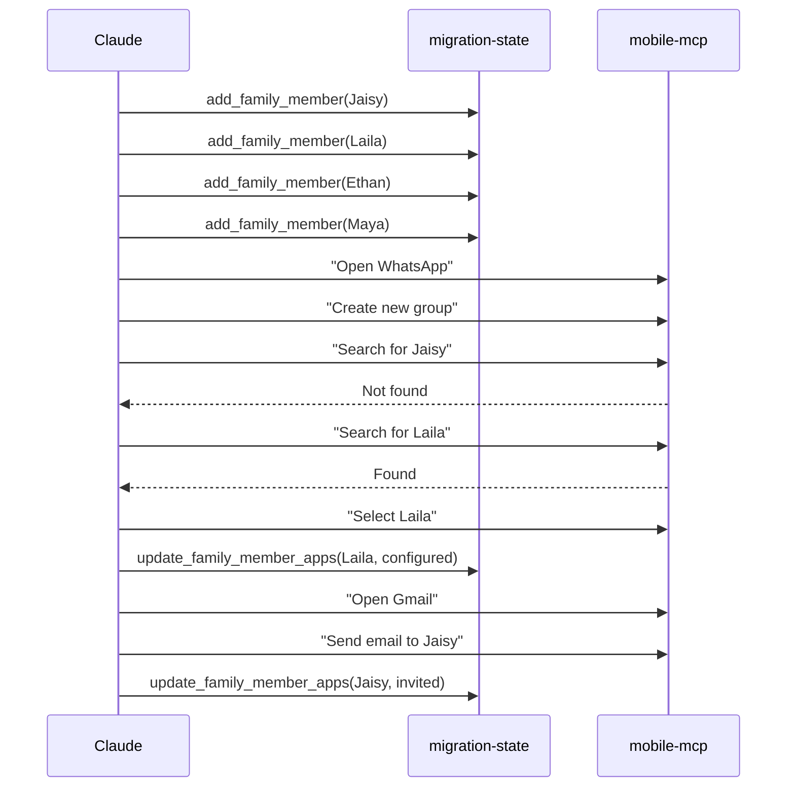

# Integration Specification V2

## Overview

This document defines how the three MCP servers (web-automation, mobile-mcp, migration-state) work together to orchestrate the complete iOS to Android migration demo.

## System Architecture

### Three MCP Servers

```
┌─────────────────────────────────────────────────────────┐
│                    Claude Desktop                        │
│                  (Orchestrator Agent)                    │
└────────┬──────────────┬──────────────┬──────────────────┘
         │              │              │
         ▼              ▼              ▼
┌──────────────┐ ┌──────────────┐ ┌──────────────────┐
│web-automation│ │  mobile-mcp  │ │ migration-state  │
│   (Mac)      │ │ (Galaxy)     │ │   (Database)     │
├──────────────┤ ├──────────────┤ ├──────────────────┤
│• iCloud auth │ │• Android UI  │ │• State tracking  │
│• Photo count │ │• App control │ │• Progress update │
│• Transfer    │ │• Screenshots │ │• Family data     │
│• Email check │ │• Email send  │ │• Report generate │
└──────────────┘ └──────────────┘ └──────────────────┘
         │              │              │
         └──────────────┴──────────────┘
                        │
                        ▼
                 ┌──────────────┐
                 │   DuckDB     │
                 │  Database    │
                 └──────────────┘
```

### Server Responsibilities

#### web-automation (Python, Playwright)
- **Purpose**: Browser automation for web services
- **Scope**: ONLY handles iCloud/Apple services
- **Key Tools**:
  - `check_icloud_status`: Get photo counts
  - `start_photo_transfer`: Initiate Apple transfer
  - `check_transfer_email`: Verify completion
- **Does NOT**: Touch Android device or family apps

#### mobile-mcp (TypeScript, ADB)
- **Purpose**: Android device control via natural language
- **Scope**: ALL Android UI automation
- **Key Capabilities**:
  - App opening/control
  - Text input
  - Button tapping
  - Screenshot capture
  - Email composition
- **Does NOT**: Store state or make decisions

#### migration-state (Python, DuckDB wrapper)
- **Purpose**: Central state management
- **Scope**: ALL data persistence and tracking
- **Key Tools**:
  - `initialize_migration`: Start tracking
  - `add_family_member`: Store family data
  - `update_photo_progress`: Track transfer
  - `generate_migration_report`: Final summary
- **Does NOT**: Perform any automation

---

## Integration Patterns

### Pattern 1: Sequential Operations

Operations that must happen in order, with state updates between steps.

#### Example: WhatsApp Group Creation



**Key Points**:
- Claude orchestrates the sequence
- Each tool updates state independently
- No direct tool-to-tool communication

### Pattern 2: Parallel Operations

Operations that can run independently without coordination.

#### Example: Photo Transfer Running While Setting Up Apps

```
Day 1-7: Photo Transfer (Background)
├── web-automation monitors progress
├── migration-state tracks metrics
└── Continues regardless of other operations

Day 1: Family Apps (Foreground)
├── WhatsApp setup via mobile-mcp
├── Location sharing via mobile-mcp
└── Updates migration-state throughout
```

**Key Points**:
- Photo transfer runs for entire week
- Family setup happens independently
- Both update shared database
- No blocking between operations

### Pattern 3: State-Driven Decisions

Claude reads state to determine next actions.

#### Example: Day 3 WhatsApp Adoption Check

```python
# Claude's decision flow
state = migration-state.get_daily_summary(day=3)

if state.whatsapp_status.invited:
    # Check if they now have WhatsApp
    for member in state.whatsapp_status.invited:
        mobile-mcp.execute("Search for {member}")
        if found:
            mobile-mcp.execute("Add {member} to group")
            migration-state.update_family_member_apps(member, "configured")
```

**Key Points**:
- State drives decisions
- Claude interprets and acts
- Tools don't make decisions

---

## State Management Patterns

### Single Source of Truth

The DuckDB database is the ONLY source of truth for migration state.

```
┌─────────────────────────────────────┐
│           DuckDB Database           │
├─────────────────────────────────────┤
│ • migration_status (current phase)  │
│ • family_members (names, emails)    │
│ • photo_transfer (progress)         │
│ • app_setup (WhatsApp, Maps, Venmo) │
│ • family_app_adoption (who has what)│
│ • daily_progress (snapshots)        │
│ • venmo_setup (teen cards)          │
└─────────────────────────────────────┘
           ▲        ▲        ▲
           │        │        │
    web-automation  │  migration-state
                    │
                mobile-mcp
```

### Update Patterns

#### Direct Updates
Tools update their specific domain:
- web-automation → photo_transfer.status
- migration-state → all tables
- mobile-mcp → none (stateless)

#### Indirect Updates
Claude coordinates multi-step updates:
1. mobile-mcp performs action
2. Claude observes result
3. Claude calls migration-state to record

### Read Patterns

#### Status Queries
- `get_migration_status()`: Overall view
- `get_daily_summary(day)`: Day-specific view
- `generate_migration_report()`: Final summary

#### Progressive Enhancement
Each query builds on previous data:
- Day 1: Basic setup
- Day 3: + WhatsApp adoption
- Day 4: + Photo progress
- Day 5: + Venmo cards
- Day 7: Complete picture

---

## Natural Language Orchestration

### Principles

1. **No Custom Code**: Everything via English commands
2. **Flexible Descriptions**: UI changes don't break commands
3. **Contextual Commands**: Include visual cues
4. **Progressive Refinement**: Start broad, get specific

### Command Patterns

#### Good Natural Language Commands

```
Opening apps:
"Open WhatsApp"
"Switch to Google Maps"
"Go to Venmo"

Navigation:
"Tap the three dots menu in top right"
"Scroll down to see more photos"
"Go back to the previous screen"

Selection:
"Select the first option"
"Choose 'Until you turn this off'"
"Pick Jaisy from the list"

Text entry:
"Type 'Vetticaden Family' as the group name"
"Enter email address: jaisy@gmail.com"
"Set PIN to 4321"

Confirmation:
"Tap the green checkmark"
"Press Continue"
"Select Done"
```

#### Commands to Avoid

```
BAD: "Click element with id com.whatsapp:id/fab"
WHY: Too technical, breaks with updates

BAD: "Tap at coordinates 540, 1920"
WHY: Screen-size dependent

BAD: "Execute JavaScript: document.querySelector('.button').click()"
WHY: Not how mobile apps work

BAD: "Call WhatsApp.createGroup() API"
WHY: No API access, only UI automation
```

### Multi-Step Flows

Complex operations broken into simple commands:

```
Creating WhatsApp Group:
1. "Open WhatsApp"
2. "Tap the three dots menu"
3. "Select New group"
4. "Search for Jaisy"
5. If not found: "Tap back"
6. If found: "Select Jaisy"
7. "Tap the green arrow"
8. "Type 'Vetticaden Family'"
9. "Tap the checkmark"
```

---

## Error Handling Strategies

### Network Failures

```python
# Retry with exponential backoff
attempts = 0
while attempts < 3:
    try:
        result = mobile-mcp.execute("Open WhatsApp")
        break
    except NetworkError:
        wait(2 ** attempts)
        attempts += 1
```

### UI Changes

```python
# Try variations of commands
commands = [
    "Tap the menu button",
    "Tap the three dots",
    "Tap the hamburger menu",
    "Tap More options"
]

for cmd in commands:
    result = mobile-mcp.execute(cmd)
    if result.success:
        break
```

### Missing Family Members

```python
# Graceful degradation
if search_result == "not_found":
    # Send email invitation
    mobile-mcp.execute("Open Gmail")
    mobile-mcp.execute("Compose new email")
    # ... send invitation
    migration-state.update_family_member_apps(name, "invited")
else:
    # Add to group
    mobile-mcp.execute(f"Select {name}")
    migration-state.update_family_member_apps(name, "configured")
```

### Partial Completions

```python
# Continue with what works
whatsapp_members = ["Jaisy", "Laila", "Ethan", "Maya"]
successful = []
failed = []

for member in whatsapp_members:
    try:
        add_to_group(member)
        successful.append(member)
    except:
        failed.append(member)

# Report partial success
print(f"Added {len(successful)}/4 members")
print(f"Will retry {failed} later")
```

---

## Data Flow Examples

### Day 1: Migration Initialization

```
1. User provides context
   ↓
2. web-automation.check_icloud_status()
   → Returns: {photos: 58460, videos: 2418, storage: 383}
   ↓
3. migration-state.initialize_migration(data)
   → Creates: migration_status record
   → Creates: photo_transfer record
   → Creates: app_setup records
   ↓
4. User provides family details
   ↓
5. migration-state.add_family_member() x4
   → Creates: family_members records
   → Creates: family_app_adoption records
   → Creates: venmo_setup records (for teens)
   ↓
6. web-automation.start_photo_transfer()
   → Updates: photo_transfer.status = 'initiated'
   ↓
7. mobile-mcp: WhatsApp group creation
   → Detects: Who has/doesn't have app
   ↓
8. migration-state.update_family_member_apps()
   → Updates: family_app_adoption status
```

### Day 4: Photo Progress Update

```
1. Claude checks day number
   ↓
2. migration-state.update_photo_progress(28%)
   → Updates: photo_transfer.transferred_photos = 16387
   → Updates: photo_transfer.status = 'in_progress'
   ↓
3. mobile-mcp: "Open Google Photos"
   → Verifies: Photos visible in app
   ↓
4. migration-state.get_daily_summary(day=4)
   → Returns: Combined status with celebration flag
   ↓
5. Claude creates React visualization
   → Shows: Progress bar, metrics, ETA
```

### Day 7: Final Validation

```
1. web-automation.check_transfer_email()
   → Finds: Apple completion email
   ↓
2. migration-state.update_photo_progress(100%)
   → Updates: photo_transfer.status = 'completed'
   → Updates: migration_status.current_phase = 'completed'
   ↓
3. mobile-mcp: "Open Google Photos"
   → Verifies: All photos present
   ↓
4. migration-state.generate_migration_report()
   → Queries: All tables for summary
   → Returns: Celebration JSON
   ↓
5. Claude creates final visualization
   → Shows: Complete success dashboard
```

---

## Testing Strategy

### Unit Testing

Each MCP server tested independently:

#### web-automation
- Mock iCloud responses
- Test session persistence
- Verify error handling

#### mobile-mcp
- Mock ADB responses
- Test command variations
- Verify screenshot capability

#### migration-state
- Test database operations
- Verify state transitions
- Check constraint violations

### Integration Testing

Test MCP servers working together:

#### Day 1 Flow Test
```python
# Initialize migration
migration_id = migration_state.initialize_migration(...)
assert migration_id is not None

# Add family members
for member in family:
    migration_state.add_family_member(member)

# Start photo transfer
web_automation.start_photo_transfer()
assert migration_state.get_status().photo_transfer == "initiated"

# Create WhatsApp group
mobile_mcp.execute("Open WhatsApp")
# ... continue flow
```

#### Progressive Day Testing
- Test each day in sequence
- Verify state builds correctly
- Check dependencies satisfied

### End-to-End Testing

Complete demo flow with real devices:

1. **Setup**: Real iPhone data, real Galaxy device
2. **Day 1-7**: Execute complete flow
3. **Validation**: Verify all success criteria
4. **Cleanup**: Reset for next test

### Demo Validation Checklist

- [ ] Photo count matches (58,460)
- [ ] Family members added (4)
- [ ] WhatsApp group created
- [ ] Location sharing active
- [ ] Venmo cards activated (Day 5)
- [ ] Photos visible (Day 4)
- [ ] Completion email received (Day 7)
- [ ] Final report accurate

---

## Performance Considerations

### Database Operations
- Indexes on all foreign keys
- Views for complex queries
- Connection pooling in migration-state

### Natural Language Processing
- Command caching for repeated operations
- Parallel execution where possible
- Timeout handling (30s default)

### State Updates
- Batch updates when possible
- Async operations for long tasks
- Progress callbacks for UI updates

---

## Security Considerations

### Credential Management
- Apple credentials in .env file
- No credentials in database
- No credentials in logs

### Family Privacy
- Email addresses required but protected
- No phone numbers stored
- No message content captured

### Data Integrity
- Foreign key constraints
- Check constraints on enums
- Transaction support for multi-step operations

---

## Success Metrics

### Technical Metrics
- ✅ Zero MCP server crashes
- ✅ All state transitions valid
- ✅ Database consistency maintained
- ✅ Natural language success rate > 95%

### Demo Metrics
- ✅ 7-day timeline achieved
- ✅ All photos transferred (58,460)
- ✅ All family connected (4/4)
- ✅ All apps configured (3/3)

### User Experience Metrics
- ✅ Natural conversation flow
- ✅ Clear progress visibility
- ✅ Celebration moment achieved
- ✅ Zero manual intervention after setup

---

## Troubleshooting Guide

### Common Issues and Solutions

#### "Mobile-mcp not responding"
- Check ADB connection: `adb devices`
- Restart ADB: `adb kill-server && adb start-server`
- Verify USB debugging enabled

#### "Photos not appearing Day 4"
- Check Apple transfer status
- Verify Google account correct
- Manual check in Google Photos app

#### "Family member not found in WhatsApp"
- Verify name spelling
- Try without last name
- Send email invitation instead

#### "Database locked"
- Close DBeaver if open
- Check for hanging connections
- Restart migration-state server

#### "Natural language command failed"
- Try command variations
- Add more context ("the green button at bottom")
- Take screenshot for debugging

---

## Appendix: Tool Coordination Matrix

| Operation | web-automation | mobile-mcp | migration-state | Claude Orchestrates |
|-----------|---------------|------------|-----------------|-------------------|
| Check iCloud photos | ✅ Execute | - | ✅ Store result | ✅ Initiate |
| Start transfer | ✅ Execute | - | ✅ Update status | ✅ Confirm |
| Add family | - | - | ✅ Store data | ✅ Collect info |
| Create WhatsApp group | - | ✅ Execute | ✅ Track status | ✅ Direct |
| Send emails | - | ✅ Execute | ✅ Mark invited | ✅ Compose |
| Check progress | - | ✅ Screenshot | ✅ Store metrics | ✅ Interpret |
| Activate cards | - | ✅ Execute | ✅ Record | ✅ Guide |
| Final report | ✅ Check email | ✅ Verify | ✅ Generate | ✅ Visualize |

This matrix shows how each operation requires coordination between multiple tools, with Claude as the orchestrator.